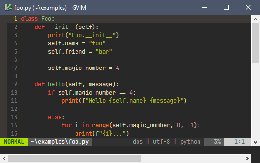

[toc](..)

# Beginner Plugins

The goal of this paragraph is to list a number of plugins for beginners.

There focus is to:
- Make Vim easier to use (more intuitive).
- Perform some basic editor task more intuitively

## Plugin-Manager

A plugin manager to install the plugins.

[vim-Plug](https://github.com/junegunn/vim-plug)

## Colorscheme

Look and feel is so important to me. I need that the editor looks good.

You can use the [VimColorSchemes](https://vimcolorschemes.com/) to help you finding a color scheme that fit your taste
and that is mature enough.

[gruvbox](https://github.com/morhetz/gruvbox) [The most popular one]

[solarized](https://github.com/altercation/vim-colors-solarized)

[onedark](https://github.com/joshdick/onedark.vim)

[nord-vim](https://github.com/nordtheme/vim) [My Favorite]

## Status Line

Look and feel is so important to me. I need that the editor looks good.

[LightLine](https://github.com/itchyny/lightline.vim)

## Wilder

[Wilder](https://github.com/gelguy/wilder.nvim)

Improves the Vim command completion menu:

Shows the completion alternatives in a vertical menu:

## [Traces](https://github.com/markonm/traces.vim)

Visualize the result of the substitution while you are typing it.
It helps you identifying the mistakes you do when using the regular expression.

## [Vim-Visual-Star-Search](https://github.com/nelstrom/vim-visual-star-search)

Extend the `*` search to the visual selection.
Useful if you need to search text containing spaces or punctuation.

## [Vim-HighlightedYank](https://github.com/machakann/vim-highlightedyank)

Shortly highlight the text you just yank (copy).
It gives you confidence to yank without first selecting.

### Fuzzy Finding

Helps you to find file and to switch buffers.

- [Fzf.vim](https://github.com/junegunn/fzf.vim)
- [Ctrlp.vim](https://github.com/kien/ctrlp.vim)
- [Vim-Clap](https://github.com/liuchengxu/vim-clap) [my favorite on Windows]

<!-- vim: set tw=120 : -->
