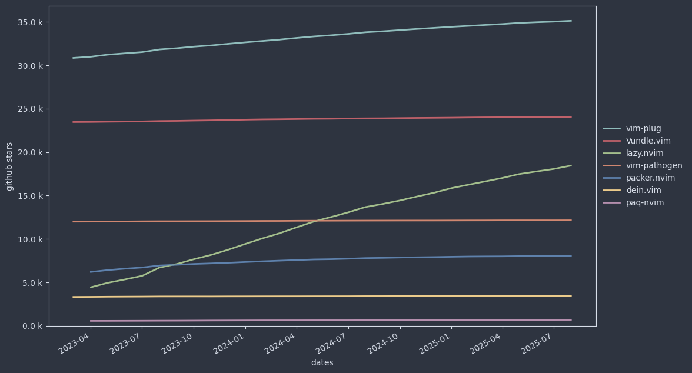
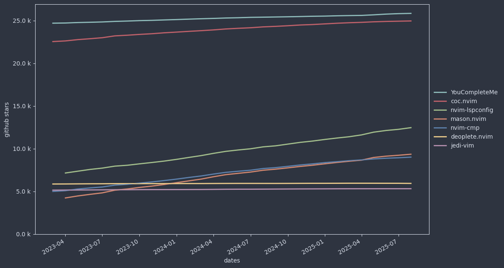
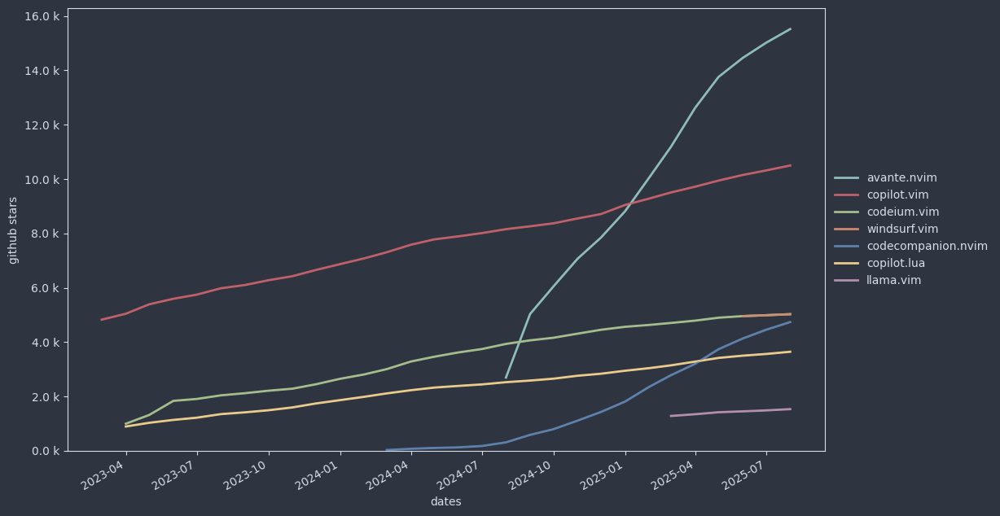
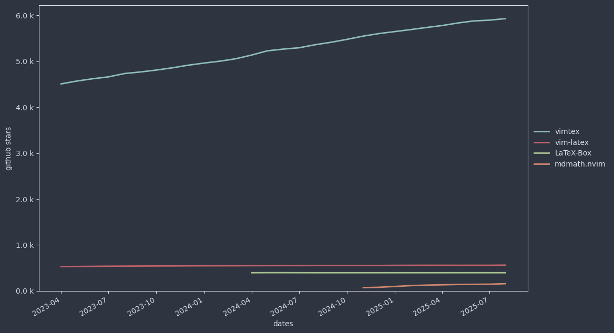
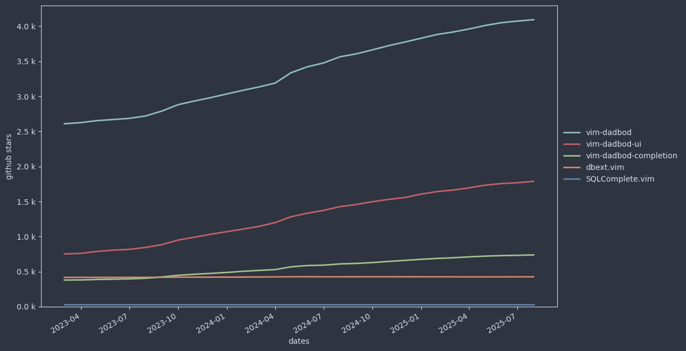
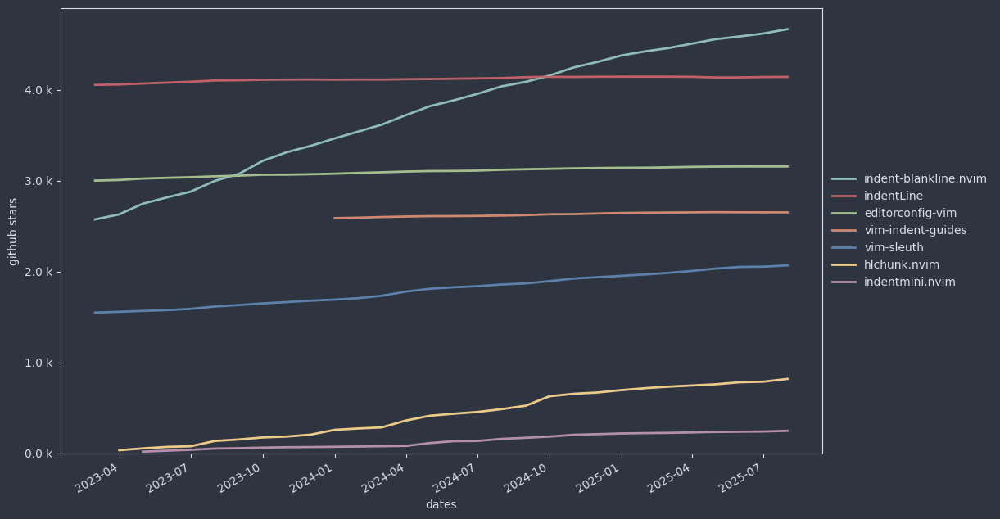
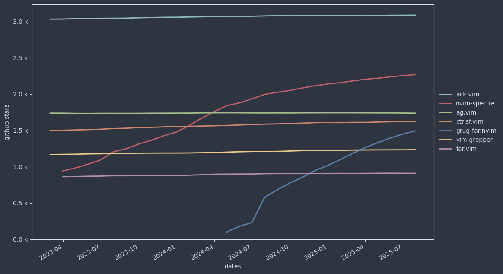
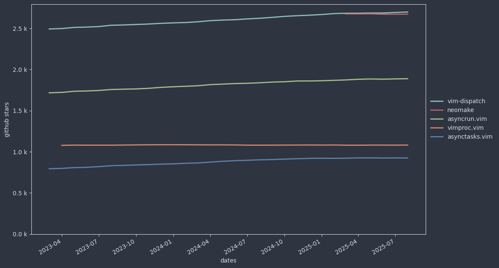
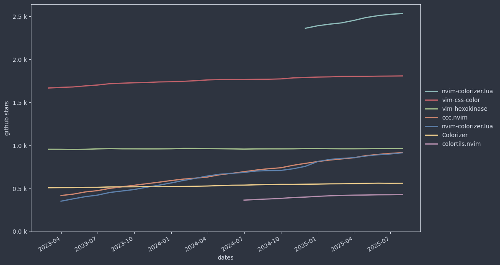

[toc](..)

# Vim Plugins

The [Popular Choices](#popular-choices) section contains Vim plugin needs where one representative gather more than 2.5k stars on GitHub.
It comes together with graphs showing the evolution of the number of stars on GitHub to easily identify the trends.

The [My Recommendations](#my-recommendations) section contains Vim plugins that I appreciate very much.

## Popular Choices

### Plugin-Manager (35.3)

- [Vim-Plug](https://github.com/junegunn/vim-plug)
- [Vundle](https://github.com/VundleVim/Vundle.vim)
- [Vim-Pathogen](https://github.com/tpope/vim-pathogen)

### Code Completion (26.2)

- [YouCompleteMe](https://github.com/ycm-core/YouCompleteMe)
- [Coc.nvim](https://github.com/neoclide/coc.nvim) [My favorite]

### Git (21.3)

- [Vim-Fugitive](https://github.com/tpope/vim-fugitive)
- [Vim-GitGutter](https://github.com/airblade/vim-gitgutter)

### File Browser (20.0)

- [NerdTree](https://github.com/preservim/nerdtree)
- [Vim-Vinegar](https://github.com/tpope/vim-vinegar)
- [Vim-Enuch](https://github.com/tpope/vim-eunuch)
- [Vim-Fern](https://github.com/lambdalisue/vim-fern)

### Status Line (17.9)

- [Vim-Airline](https://github.com/vim-airline/vim-airline)
- [PowerLine](https://github.com/powerline/powerline)
- [LightLine](https://github.com/itchyny/lightline.vim)

### Fuzzy Finding (18.4)

- [Fzf.vim](https://github.com/junegunn/fzf.vim)
- [Ctrlp.vim](https://github.com/kien/ctrlp.vim)
- [Skim](https://github.com/skim-rs/skim)
- [Vim-Clap](https://github.com/liuchengxu/vim-clap) [My favorite on Windows]

### AI (16.2)

- [Copilot.vim](https://github.com/github/copilot.vim)
- [Windsurf.vim](https://github.com/Exafunction/windsurf.vim)

### Color Schemes (14.9)

- [Gruvbox](https://github.com/morhetz/gruvbox)
- [Vim-Colors-Solarized](https://github.com/altercation/vim-colors-solarized)
- [Onedark](https://github.com/joshdick/onedark.vim)
- [Molokai](https://github.com/tomasr/molokai)
- [Everforest](https://github.com/sainnhe/everforest)
- [Papercolor-Theme](https://github.com/NLKNguyen/papercolor-theme)

### Linting (13.9)

- [ALE](https://github.com/dense-analysis/ale)
- [Syntastic](https://github.com/vim-syntastic/syntastic)

### Parenthesis (13.9)

- [Vim-Surround](https://github.com/tpope/vim-surround)
- [Auto-Pairs](https://github.com/jiangmiao/auto-pairs)

### Note Taking (9.3)

- [VimWiki](https://github.com/vimwiki/vimwiki)

### Marks (8.6)

- [Vim-Signature](https://github.com/kshenoy/vim-signature)
- [Vim-Bookmarks](https://github.com/MattesGroeger/vim-bookmarks)

### Multiple Cursors (8.0)

- [Vim-Visual-Multi](https://github.com/mg979/vim-visual-multi)

### Snippet (7.7)

- [UltiSnips](https://github.com/SirVer/ultisnips)
- [Emmet-vim](https://github.com/mattn/emmet-vim)

### Motion (7.7)

- [Vim-Easymotion](https://github.com/easymotion/vim-easymotion)
- [Vim-Sneak](https://github.com/justinmk/vim-sneak)
- [Clever-F](https://github.com/rhysd/clever-f.vim)
- [Quick-Scope](https://github.com/unblevable/quick-scope)

### Keybinding (6.6)

- [Vim-Which-Key](https://github.com/liuchengxu/vim-which-key)

### Debugging (6.4)

- [Vimspector](vimspector)

### Tag List (6.2)

- [TagBar](https://github.com/preservim/tagbar)
- [Vim-Gutentags](https://github.com/ludovicchabant/vim-gutentags)

### Code Commenting (6.1)

- [Vim-Commentary](https://github.com/tpope/vim-commentary)
- [NerdCommenter](https://github.com/preservim/nerdcommenter)

### Language Support (5.7)

- [Vim-Polyglot](https://github.com/sheerun/vim-polyglot)

#### Go (16.2)

- [Vim-Go](https://github.com/fatih/vim-go)

#### TeX (6.0)

- [VimTeX](https://github.com/lervag/vimtex)

#### Python (5.5)

- [Python-Mode](https://github.com/python-mode/python-mode)

#### Rust (4.1)

- [Rust](https://github.com/rust-lang/rust.vim)

### Dashboard (5.4)

- [Vim-Startify](https://github.com/mhinz/vim-startify)

### Terminal Integration (5.2)

- [Vim-Floaterm](https://github.com/voldikss/vim-floaterm)
- [Neoterm](https://github.com/kassio/neoterm)

### Zen (4.6)

- [Goyo](https://github.com/junegunn/goyo.vim)

### Formatting (4.6)

- [Vim-Autoformat](https://github.com/vim-autoformat/vim-autoformat)
- [Vim-Prettier](https://github.com/prettier/vim-prettier)

### Undo Tree (4.4)

- [UndoTree](https://github.com/mbbill/undotree)
- [gUndo](https://github.com/sjl/gundo.vim)

### Databases (4.2)

- [Vim-DadBod](https://github.com/tpope/vim-dadbod)

### Align (4.2)

- [Vim-Easy-Align](https://github.com/junegunn/vim-easy-align)
- [Tabular](https://github.com/godlygeek/tabular)

### Learning (4.1)

- [Hardmode](https://github.com/wikitopian/hardmode)

### Indent (4.1)

- [IndentLine](https://github.com/Yggdroot/indentLine)
- [EditorConfig](https://github.com/editorconfig/editorconfig-vim)
- [Vim-Indent-Guides](https://github.com/preservim/vim-indent-guides)
- [Vim-Sleuth](https://github.com/tpope/vim-sleuth)

### TODO (3.9)

- [Todo.Txt-Vim](https://github.com/freitass/todo.txt-vim)

### Search in Files (3.1)

- [Ack.vim](https://github.com/mileszs/ack.vim)
- [Ctrlsf.vim](https://github.com/dyng/ctrlsf.vim) [My favorite]

### Test (3.1)

- [Vim-Test](https://github.com/vim-test/vim-test)
- [Vader.Vim](https://github.com/junegunn/vader.vim)

#### Read Eval Print Loop (REPL) (3.1)

- [Codi.Vim](https://github.com/metakirby5/codi.vim) [Only for Unix based OS]
- [Jupyter-Vim](https://github.com/jupyter-vim/jupyter-vim) [My favorite]

### Context (3.0)

- [Context](https://github.com/wellle/context.vim)

### Folding (2.8)

- [FastFold](https://github.com/Konfekt/FastFold)
- [Vim-Anyfold](https://github.com/pseewald/vim-anyfold)

### Indicators (2.7)

- [Vim-Signify](https://github.com/mhinz/vim-signify)

### Asynchronous Execution (2.7)

- [Vim-Dispatch](https://github.com/tpope/vim-dispatch)
- [AsyncRun](https://github.com/skywind3000/asyncrun.vim)

### Colorizer (2.6)

- [Vim-Css-Color](https://github.com/ap/vim-css-color)

### Text Objects (2.6)

- [Targets](https://github.com/wellle/targets.vim)

## My Recommendations

### [Vim-HighlightedYank](https://github.com/machakann/vim-highlightedyank)

Shortly highlight the text you just yank (copy).
It gives you confidence to yank without first selecting.

<video width="320" heigh="200" controls>
<source src="/videos/HighligthedYank.mp4" type="video/mp4">
</video>

### [Wilder](https://github.com/gelguy/wilder.nvim)

Improves the Vim command completion menu:

Shows the completion alternatives in a vertical menu:

### [Traces](https://github.com/markonm/traces.vim)

Visualize the result of the substitution while you are typing it.
It helps you identifying the mistakes you do when using the regular expression.

### [Vim-Visual-Star-Search](https://github.com/nelstrom/vim-visual-star-search)

Extend the `*` search to the visual selection.
Useful if you need to search text containing spaces or punctuation.

### [Vim-Rooter](https://github.com/airblade/vim-rooter)

Automatically change the Vim current directory to the root of the corresponding project.
It helps in the usage of `make`, `grep` and various plugin like NERDTree, fugitive, Coc, LSP integration in general.

### [Unimpaired](https://github.com/tpope/vim-unimpaired)

Add additional `[` mappings recommended by Tim Pope.

### [Vim-Signature](https://github.com/kshenoy/vim-signature)

Add a sign in the margin to visualize where the marks are.

### [UndoTree](https://github.com/kshenoy/vim-signature)

Gives you easy access to the full Vim undo tree.
Help you recovering the version of the file you want (even when you didn't commit it)

### [Context](https://github.com/wellle/context.vim)

Make sure the context lines (class name, function name, if, for) related to the cursor line remains visible:

<video width="320" heigh="200" controls>
<source src="/videos/Context.mp4" type="video/mp4">
</video>

### [Vim-AnyFold](https://github.com/pseewald/vim-anyfold)

Introduces fold based on indentation.

It allows you to see your full script at glance:

### [Vim-Remotions](https://github.com/vds2212/vim-remotions)

Make it possible to repeat motions or actions behind edition (`.`), substitution (`&`) or command (`@:`) repetition.

## Remarks

There are a lot of plugins.
[VimAwesome](https://vimawesome.com/) mentions about 19.000.
I follow about 1.700.

My review is based on months of collecting plugins via blogs but also via plugin directories:
- [vimawesome](https://vimawesome.com/)
- [vimcolorscheme](https://vimcolorschemes.com/)
- [neovimcraft](https://neovimcraft.com/)
- [trending Neovim plugins](https://dotfyle.com/neovim/plugins/trending)

I have restricted the list (but not the graphs) to the plugins that supports both Vim and Neovim.

Last update: 2025-10-17

