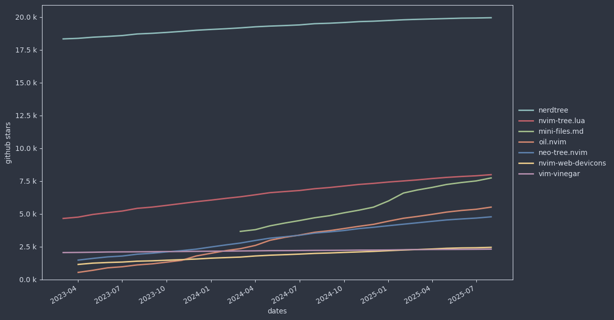
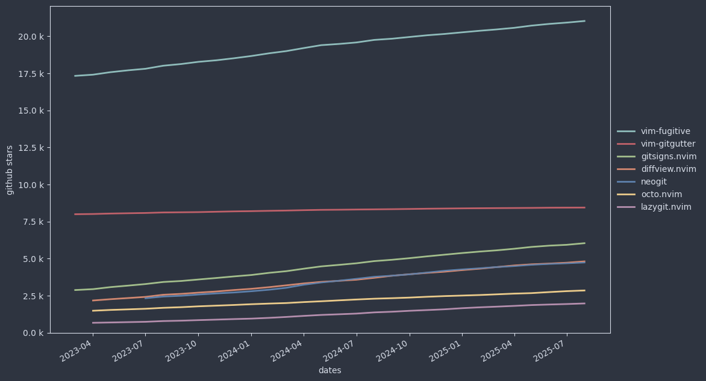
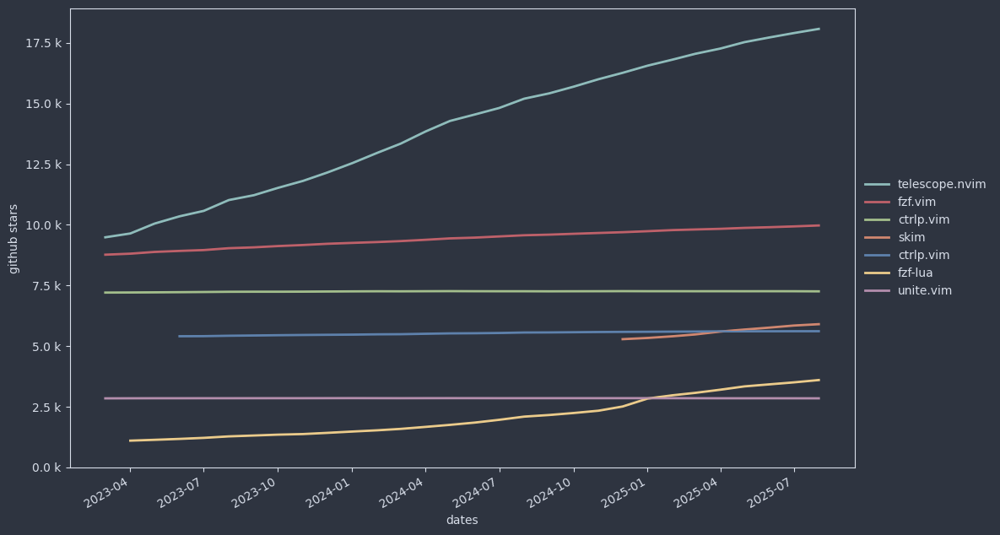

# Vim Plugins

Plugin choice depends on your need and taste.
There are a lot of plugins.
[VimAwesome](https://vimawesome.com/) mentions about 19 thousand.
I follow about 700.

In the [Categories](#categories) list I have identified the needs that gathers enough of attention such that one project get more than two thousand stars on github (as of 31/10/2023).

Remark: I have restricted the list to the plugins that supports both Vim and Neovim.

It is based on months of collecting plugins via blogs but also via plugin directories:
- [vimawesome](https://vimawesome.com/)
- [vimcolorscheme](https://vimcolorschemes.com/)
- [neovimcraft](https://neovimcraft.com/)
- [trending Neovim plugins](https://dotfyle.com/neovim/plugins/trending)

It does not reflect my personal choice although I use or I have tested a fair amount of these.

Remark: There are numerous plugins that I like and use very often and that are not listed because the corresponding need did reach the two thousand target that I have fixed 

In the [Recommendations](#recommendations) list I have added a number of plugins that doesn't reach the two thousand threshold but that I consider very useful.

## Categories

### Plugin-Manager (32.0):

- [vim-Plug](https://github.com/junegunn/vim-plug)
- [Vundle](https://github.com/VundleVim/Vundle.vim)
- [Vim-Pathogen](https://github.com/tpope/vim-pathogen)

### Code Completion (25.0):

- [YouCompleteMe](https://github.com/ycm-core/YouCompleteMe)
- [Coc.nvim](https://github.com/neoclide/coc.nvim) [my favorite]

### File Browser (18.8):

- [NerdTree](https://github.com/preservim/nerdtree)

### Git (18.2):

- [Vim-Fugitive](https://github.com/tpope/vim-fugitive)
- [Vim-GitGutter](https://github.com/airblade/vim-gitgutter)

### Status Line (17.4):

- [Vim-Airline](https://github.com/vim-airline/vim-airline)
- [PowerLine](https://github.com/powerline/powerline)
- [LightLine](https://github.com/itchyny/lightline.vim)

### Colorscheme (12.5)

- [gruvbox](https://github.com/morhetz/gruvbox)
- [vim-colors-solarized](https://github.com/altercation/vim-colors-solarized)

### Fuzzy Finding (8.9):

- [Fzf.vim](https://github.com/junegunn/fzf.vim)
- [Ctrlp.vim](https://github.com/kien/ctrlp.vim)
- [Vim-Clap](https://github.com/liuchengxu/vim-clap) [my favorite]

### Linting (12.9):

- [ALE](https://github.com/dense-analysis/ale)
- [Syntastic](https://github.com/vim-syntastic/syntastic)

### Parenthesis (12.5):

- [Vim-Surround](https://github.com/tpope/vim-surround)
- [Auto-Pairs](https://github.com/jiangmiao/auto-pairs)

### Note Taking (8.1):

- [VimWiki](https://github.com/vimwiki/vimwiki)

### Snippet (7.3):

- [UltiSnips](https://github.com/SirVer/ultisnips)
- [Emmet-vim](https://github.com/mattn/emmet-vim)

### Motion (7.2):

- [Vim-Easymotion](https://github.com/easymotion/vim-easymotion)
- [Vim-Sneak](https://github.com/justinmk/vim-sneak)

### Tag List (6.0):

- [TagBar](https://github.com/preservim/tagbar)
- [Vim-Gutentags](https://github.com/ludovicchabant/vim-gutentags)

### Code Commenting (5.5):

- [Vim-Commentary](https://github.com/tpope/vim-commentary)
- [NerdCommenter](https://github.com/preservim/nerdcommenter)

### Language Support (5.4):

- [Vimspector](https://github.com/puremourning/vimspector)
- [Vim-Polyglot](https://github.com/sheerun/vim-polyglot)

### Dashboard (5.2):

- [Vim-Startify](https://github.com/mhinz/vim-startify)

### Search in Files (3.2):

- [Ack.vim](https://github.com/mileszs/ack.vim)
- [Ctrlsf.vim](https://github.com/dyng/ctrlsf.vim) [my favorite]

### Undo Tree (3.1):

- [UndoTree](https://github.com/mbbill/undotree)
- [gUndo](https://github.com/sjl/gundo.vim)

### Test (2.7):

- [Vim-Test](https://github.com/vim-test/vim-test)

### Indicators (2.7):

- [Vim-Signify](https://github.com/mhinz/vim-signify)

### Asynchronous Tasks (2.5):

- [Vim-Dispatch](https://github.com/tpope/vim-dispatch)
- [AsyncRun](https://github.com/skywind3000/asyncrun.vim)

### Text Objects (2.3):

- [Targets](https://github.com/wellle/targets.vim)

## Recommendations

- [Vim-HighlightedYank](https://github.com/machakann/vim-highlightedyank)

    Shortly highlight the text you just yank (copy).
    It gives you confidence to yank without first selecting.

- [Wilder](https://github.com/gelguy/wilder.nvim)

- [Traces](https://github.com/markonm/traces.vim)

    Visualize the result of the substitution while you are typing it.
    It helps you identifying the mistakes you do when using the regular expression.

- [Vim-Visual-Star-Search](https://github.com/nelstrom/vim-visual-star-search)

    Extend the `*` search to the visual selection (useful if you need to search text containing spaces)

- [Vim-Rooter](https://github.com/airblade/vim-rooter)

    Automatically change the Vim current directory to the root of the corresponding project.
    It helps in the usage of `make`, `grep` and various plugin like NERDTree, fugitive, Coc, LSP integration in general.

- [Unimpaired](https://github.com/tpope/vim-unimpaired)

    Add additional `[` mapping recommended by Tim Pope.

- [Vim-Signature](https://github.com/kshenoy/vim-signature)

- [UndoTree](https://github.com/kshenoy/vim-signature)

    Give you easy access to the full Vim undo tree.
    Help you recovering the version of the file you want (even when you didn't commit it)

- [Context](https://github.com/wellle/context.vim)

- [Vim-AnyFold](https://github.com/pseewald/vim-anyfold)

- [Vim-Remotions](https://github.com/vds2212/vim-remotions)

    Make it possible to repeat motions or actions behind edition `.`, substitution `&` or command `@:` repetition.
